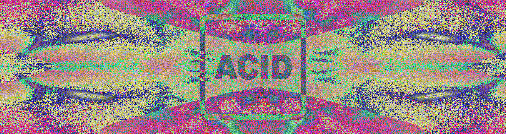
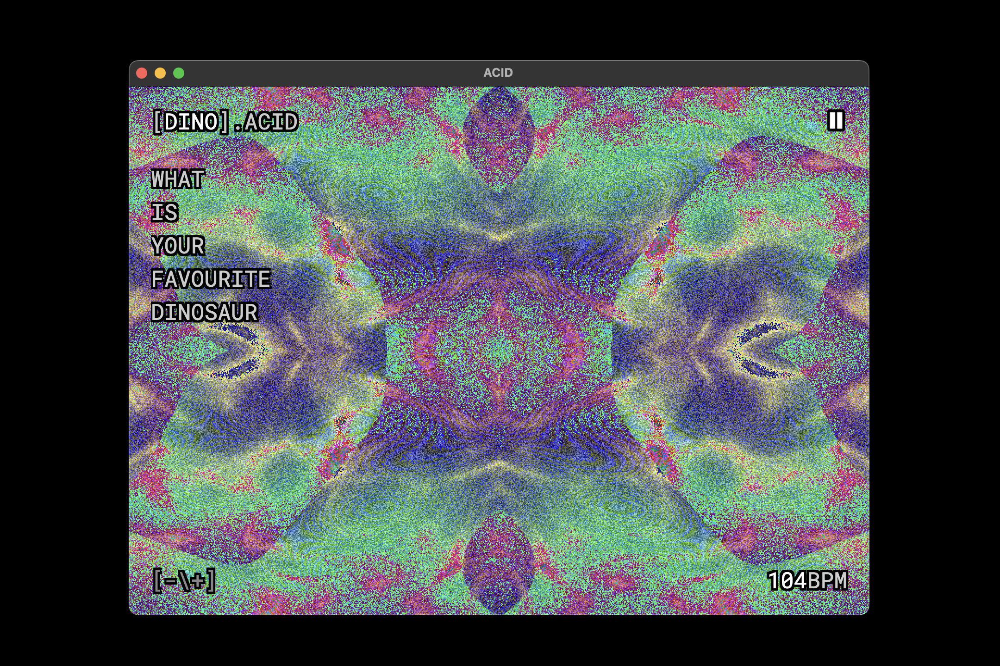
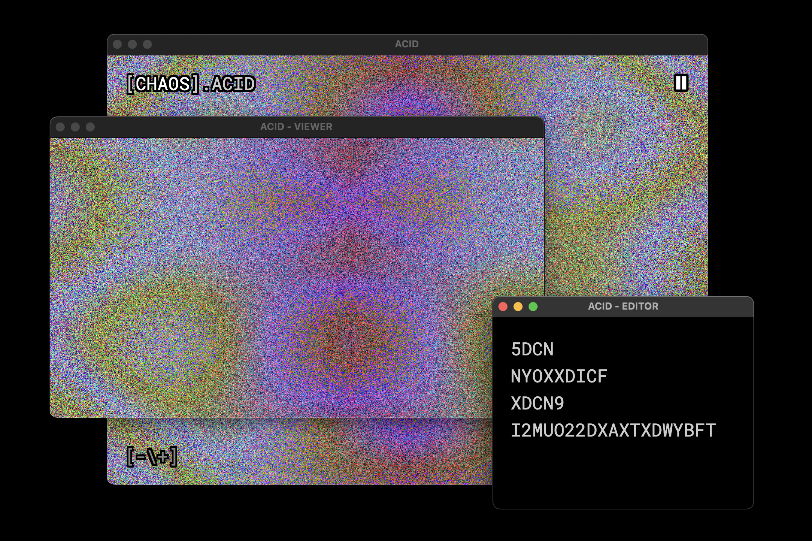

# ACID

ACID is short for **A**lgorithms **C**reate **I**mage **D**ata and is a livecoding enviroment for generating visuals.

Please refer to [this](https://github.com/adult-video/acid) documentation for the programming language ACID.





## Installation

There are two ways to take ACID. Either install a build for your platform from itch.io: [acidatm.itch.io/acid](https://acidatm.itch.io/acid)

Or run it within electron.js

```
git clone --recurse-submodules https://github.com/adult-video/acid-app.git
cd acid-app/app
npm install
npm start
```

## Usage

```
A Add -> adds two values together
B Bitmap(n) -> returns a value array of all characters in the line
C Clock(divider) -> returns a linear clock function
D Divide -> divides two values
E Expand(v) -> makes lower values larger
F Frame(divider) -> returns the frame number
G Greater(a,b) -> returns the greater of two values
H cursorX -> returns the value of the x position of the cursor
I Invert(v) -> inverts a value
J cursorY -> returns the value of the y position of the cursor
K Compress(v) -> makes larger values smaller
L Lower(a,b) -> returns the lower of two values
M Minus -> substracts two values from each other
N Noise(p) -> steps through simplex noise
O Perlin(p) -> steps through perlin noise
P Plasma(p) -> steps through plasma
Q Square(v) -> returns a square wave
R Random -> returns a random value
S Sine(v) -> returns a sine wave
T Times -> multiplies two values
U Uncertainty -> returns a random value that changes every bar
V Triangle(v) -> returns a triangular function
W Water(p) -> steps through a water shader
X X -> returns x position on grid
Y Y -> returns y position on grid
Z Keypress -> returns boolean of space key pressed
```

### UI

From the UI you can access many functions that are also accessible from the main menu. They will be explained in their respective menu subsection. The only function exclusively available in the UI is the option to rename the file. Simply click on the filename written in square brackets in the top right corner to edit the filename.

### File

- Save - Will save the current state as a `.acid` file
- Open - Allows you to open a previously state that was saved to file.
- Settings - Will open the Settings window
- Export Image - Will export a PNG of the current visual (without text). You can stop the sequencer and then use the `Transport>Forwards` and `Transport>Backwards` functions from the menu to slowly step through the visual.
- Start Recording -> Will start the inbuilt screen recorder for the visual (without text). A running recording is indicated by the blinking transport button in the upper right corner
- Stop Recording -> Will stop a running recording and save it as a `.webm` video.

### View

- Zoom In - Increases the fontsize. Mirrored in `Settings`
- Zoom Out - Decreses the fontsize. Mirrored in `Settings`
- Text Align - Toggles between text alignment on the left and in the center for all main inputs. Mirrored in `Settings`
- Toggle UI - Toggles the display of the UI in the main window.

### Transport

- Play Pause - Toggles between play and pause state of the transport
- Stop - Stops playback and resets
- Tempo Up - Ups the tempo by 1 bpm.
- Tempo Down - Lowers the tempo by 1 bpm.
- Tap Tempo - Will set the tempo based on the interval that the shortcut is being used with.
- Forwards - Will add a 50ms delay and advance the time uniform for the shader. Can be used to step through the visual when playback is stopped.
- Backwards - Will remove 50ms delay. The delay is reset when the application is restarted. Current delay is not visible anywhere.

### Window

- Focus Workspace - Will bring the main window to the front
- Switch Window - Will switch between all open application windows
- Open Viewer - Will open a standalone viewer window for the visual
- Open Editor - Will open a standalone editor that is synced with the main window but has no UI and no visual in the background

## Version History

- **0.1.0** - Initial release
  - **0.1.1** - New features
  - **0.1.2** - Replaced canvas with WebGL

- **0.2.0** - Switched to unified codebase, replace GUI with new single character programming language similiar to TRAM

## Known Issues

- Currently there are no build for Windows and Linux platforms available

## Future Plans

- Builds for all platforms
- Add export for fragment shader code
- Add support for indexed colormodes
- Add support for curve based color grading
- Add fractal operator
- Add gradient operator

## Acknowledgement

Please refer to the respective repository for ACID